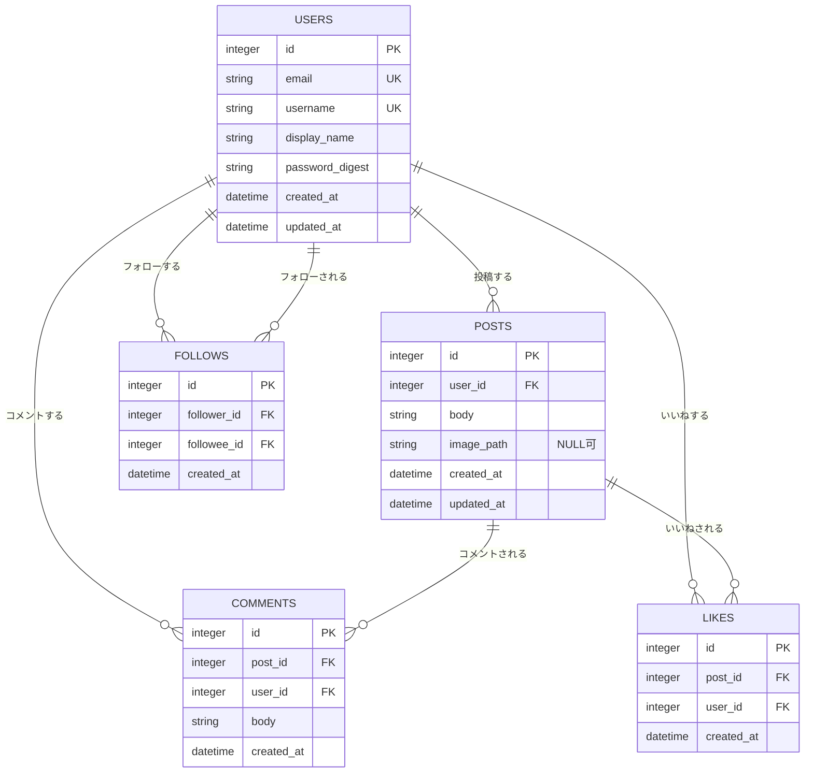

# RaiseTechタイムライン ER図

画面は [画面仕様書](./screens.md)、件数の出し方は [機能定義書](./FEATURES/機能定義書.md) を参照する。

## 1. 関連図

複数ユーザーが投稿し、第三者がコメント・いいね・フォローを付ける。件数は `comments`・`likes`・`follows` の行数で出す。



## 2. テーブル定義

### users（利用者）

受講生・個人のアカウント。一人ひとりが1行。

| 列 | 型 | 制約 | 説明 |
|----|----|------|------|
| id | INTEGER | PK | 利用者ID |
| email | VARCHAR(255) | UNIQUE, NOT NULL | ログイン用。画面には出さない運用でもよい |
| username | VARCHAR(20) | UNIQUE, NOT NULL | 検索・プロフィールURL用。半角英小文字・数字・`_` |
| display_name | VARCHAR(20) | NOT NULL | タイムラインに出す名前 |
| password_digest | VARCHAR(255) | NOT NULL | ハッシュ済みパスワード。平文は持たない |
| created_at | DATETIME | NOT NULL | 登録日時 |
| updated_at | DATETIME | NOT NULL | 更新日時 |

### posts（投稿）

本文は必須。画像は任意なので `image_path` は NULL を許す。

| 列 | 型 | 制約 | 説明 |
|----|----|------|------|
| id | INTEGER | PK | 投稿ID |
| user_id | INTEGER | FK → users.id, NOT NULL | 投稿者 |
| body | VARCHAR(280) | NOT NULL | 本文 |
| image_path | VARCHAR(512) | NULL可 | 保存した画像のパス。無ければ NULL |
| created_at | DATETIME | NOT NULL | 投稿日時（タイムラインの並び） |
| updated_at | DATETIME | NOT NULL | 更新日時 |

画像ファイルの実体は `uploads/` などに置き、DBにはパスだけ持つ。

### comments（コメント）

第三者を含む全ユーザーのコメント。投稿詳細の一覧と、タイムラインの件数の元データ。

| 列 | 型 | 制約 | 説明 |
|----|----|------|------|
| id | INTEGER | PK | コメントID |
| post_id | INTEGER | FK → posts.id, NOT NULL | 対象の投稿 |
| user_id | INTEGER | FK → users.id, NOT NULL | コメントした人 |
| body | VARCHAR(140) | NOT NULL | コメント本文 |
| created_at | DATETIME | NOT NULL | 投稿日時 |

投稿が消えたらコメントも消す（外部キー ON DELETE CASCADE）。

### likes（いいね）

同じ人が同じ投稿に2回付けられないようにする。

| 列 | 型 | 制約 | 説明 |
|----|----|------|------|
| id | INTEGER | PK | いいねID |
| post_id | INTEGER | FK → posts.id, NOT NULL | 対象の投稿 |
| user_id | INTEGER | FK → users.id, NOT NULL | いいねした人 |
| created_at | DATETIME | NOT NULL | いいねした日時 |

一意制約: `UNIQUE (post_id, user_id)`

取り消しは行を削除する。投稿削除時は CASCADE。

### follows（フォロー）

誰が誰をフォローしているか。片方向。相互フォローは2行になる。

| 列 | 型 | 制約 | 説明 |
|----|----|------|------|
| id | INTEGER | PK | フォローID |
| follower_id | INTEGER | FK → users.id, NOT NULL | フォローした人（自分） |
| followee_id | INTEGER | FK → users.id, NOT NULL | フォローされた人（相手） |
| created_at | DATETIME | NOT NULL | フォローした日時 |

一意制約: `UNIQUE (follower_id, followee_id)`

チェック制約: `follower_id <> followee_id`（自分自身は不可）

解除は行を削除する。

## 3. 画面用の派生項目（テーブルには持たない）

いいね数・コメント数は毎回集計する。列として posts にキャッシュしてもよいが、MVPは集計で足りる。

| 名前 | 出し方 | 使う画面 |
|------|--------|----------|
| comment_count | `COUNT(comments.id) GROUP BY post_id` | タイムライン、詳細、プロフィール |
| like_count | `COUNT(likes.id) GROUP BY post_id` | 同上 |
| liked_by_me | 現在ユーザーの likes 行があるか | ハートの塗りつぶし |
| following_count | `COUNT(follows.id) WHERE follower_id = その人` | プロフィール「フォロー n」 |
| follower_count | `COUNT(follows.id) WHERE followee_id = その人` | プロフィール「フォロワー n」 |
| followed_by_me | 現在ユーザー→その人の follows 行があるか | フォローボタン |

N+1を避けるため、投稿一覧では JOIN またはサブクエリで件数をまとめて取る。「フォロー中」タイムラインは `posts.user_id IN (自分, フォロー先)` を1回のクエリで取る。

## 4. 参照整合性

```
users 1 ─── * posts
users 1 ─── * comments
users 1 ─── * likes
users 1 ─── * follows（follower_id: フォローする）
users 1 ─── * follows（followee_id: フォローされる）
posts 1 ─── * comments
posts 1 ─── * likes
```

- ユーザーを消す場合、その人の投稿・コメント・いいね・フォローの扱いを実装時に決める（学習用ならユーザー削除は作らなくてよい）
- いいねの重複は DB の UNIQUE で防ぐ。フォローも同様。画面の二重クリックだけに頼らない
- 自分自身へのフォローは CHECK 制約（またはアプリ側の拒否）で防ぐ

## 5. 学習用の初期データ（実装時）

受け入れの「A・B・Cの3人」を再現できるように、シードを用意する。

| 表示名 | ユーザー名 | 用途 |
|--------|------------|------|
| 山田 | yamada | 投稿する人（A）。佐藤にフォローされる |
| 佐藤 | hanako | いいねする人（B）。山田をフォローする |
| 鈴木 | ichiro | コメントする人（C）。最初は誰もフォローしない |

パスワードは全員同じデモ用でよいが、ハッシュして入れる。提出物や画面に平文を残さない。
