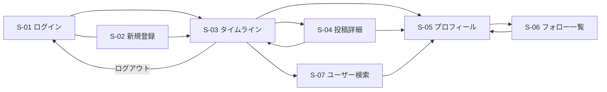

# RaiseTechタイムライン 画面仕様書

機能の動きは [機能定義書](./FEATURES/機能定義書.md) を参照する。

## 1. 画面一覧

| ID | 画面名 | パス（仮） | ログイン | 役割 |
|----|--------|------------|----------|------|
| S-01 | ログイン | `/login` | 不要 | 入室 |
| S-02 | 新規登録 | `/signup` | 不要 | アカウント作成 |
| S-03 | タイムライン | `/` | 必要 | 投稿と一覧（すべて／フォロー中） |
| S-04 | 投稿詳細 | `/posts/:id` | 必要 | 本文・画像・コメント。ユーザー名はプロフィールへ |
| S-05 | プロフィール | `/users/:username` | 必要 | その人の投稿、フォロー／解除、件数 |
| S-06 | フォロー一覧 | `/users/:username/followees` `/users/:username/followers` | 必要 | フォロー中／フォロワーの名前 |
| S-07 | ユーザー検索 | `/search?q=` | 必要 | ユーザー名検索の結果 |

未ログインで S-03〜S-07 を開いたら S-01 へ戻す。

## 2. 画面遷移



## 3. 共通ヘッダー（ログイン後）

左: アプリ名「RaiseTechタイムライン」  
中央: ユーザー名の検索欄（Enter または検索ボタンで S-07）  
右: 自分の表示名、ログアウト

アプリ名をクリックするとタイムラインへ戻る。表示名をクリックすると自分のプロフィールへ。投稿・コメントに出るユーザー名は、どこでもプロフィール（S-05）へ進み、そこからフォローできる。

---

## S-01 ログイン

### 目的

登録済みユーザーがメールとパスワードで入る。

### ワイヤー

```
+--------------------------------------+
|        RaiseTechタイムライン         |
|                                      |
|   メールアドレス  [                ] |
|   パスワード      [                ] |
|                                      |
|           [ ログイン ]               |
|                                      |
|   初めての人は 新規登録              |
+--------------------------------------+
```

### 項目

| 項目 | 種別 | 必須 | 制約 |
|------|------|------|------|
| メールアドレス | 入力 | はい | メール形式 |
| パスワード | パスワード | はい | 入力内容は伏せる |
| ログイン | ボタン | — | 成功でタイムライン |
| 新規登録 | リンク | — | S-02 へ |

### メッセージ

- 失敗: 「メールアドレスまたはパスワードが違います」
- 未入力: 「メールアドレスとパスワードを入力してください」

---

## S-02 新規登録

複数ユーザーを作る入口。受講生が各自アカウントを持てるようにする。

### ワイヤー

```
+--------------------------------------+
|              新規登録                |
|                                      |
|   ユーザー名      [ yamada_1       ] |
|   表示名          [                ] |
|   メールアドレス  [                ] |
|   パスワード      [                ] |
|   パスワード確認  [                ] |
|                                      |
|           [ 登録する ]               |
|                                      |
|   すでにアカウントがある人は ログイン|
+--------------------------------------+
```

### 項目

| 項目 | 必須 | 制約 |
|------|------|------|
| ユーザー名 | はい | 3〜20文字。半角英小文字・数字・`_`。一意。検索とプロフィールURLに使う |
| 表示名 | はい | 1〜20文字。タイムラインに出す名前 |
| メールアドレス | はい | 重複不可 |
| パスワード | はい | 8文字以上 |
| パスワード確認 | はい | パスワードと一致 |

登録成功後はログイン状態でタイムラインへ進む。

---

## S-03 タイムライン（メイン）

受講生全体の流れと、フォローした人だけの流れ。ここで投稿し、いいね数とコメント数を見る。

### ワイヤー

```
+--------------------------------------------------+
| RaiseTechタイムライン  [ユーザー名で検索 ] 山田  [ログアウト] |
+--------------------------------------------------+
| いまどうしてる？                                 |
| [本文 280文字まで                              ] |
| [画像を選ぶ]  選択中: photo.jpg                   |
|                         [ 投稿する ]             |
+--------------------------------------------------+
| [ すべて ]  [ フォロー中 ]                       |
+--------------------------------------------------+
| 佐藤 花子  @hanako  2026-08-17 21:00             |
| 課題の要件定義、今日スタートした                 |
| [画像サムネイル]                                 |
| ♥ 3    コメント 2件                              |
+--------------------------------------------------+
| 鈴木 一郎  @ichiro  2026-08-17 20:45             |
| タイムラインの件数、一覧で見えないと困る         |
| ♥ 1    コメント 0件                              |
+--------------------------------------------------+
```

初期表示は「すべて」。フォロー中が0件のときは「フォロー中の投稿はまだありません。プロフィールからフォローできます」と出す。

### 投稿欄

| 項目 | 必須 | 制約 |
|------|------|------|
| 本文 | はい | 1〜280文字。残り文字数を出す |
| 画像 | いいえ | 1枚。JPEG / PNG / WebP、5MBまで |
| 投稿する | — | 成功したら一覧の先頭に出る。欄を空にする |

タブ「すべて」は全投稿。「フォロー中」はフォローした人と自分の投稿だけ。投稿欄はどちらのタブでも同じ。

### 1件分のカード

| 出すもの | 説明 |
|----------|------|
| 表示名 | 押すと S-05 |
| ユーザー名（@hanako） | 押すと S-05。プロフィールからフォローできる |
| 日時 | 投稿日時 |
| 本文 | 改行を反映 |
| 画像 | あれば縮小。押すと S-04 |
| いいね | 件数と、自分が押済みかどうか。押すと F-04 |
| コメント | 「コメント n件」。押すと S-04 |

第三者の反応がカード上で分かることを、この画面の合格条件にする。

---

## S-04 投稿詳細

コメントの読み書きをする画面。タイムラインより本文と画像を大きく出す。

### ワイヤー

```
+--------------------------------------------------+
| ← タイムライン                                   |
+--------------------------------------------------+
| 佐藤 花子  @hanako  2026-08-17 21:00             |
| 課題の要件定義、今日スタートした                 |
| [画像 大きめ]                                    |
| ♥ 3                                              |
+--------------------------------------------------+
| コメント 2件                                     |
| ----------------------------------------------   |
| 山田 @yamada  21:05  画像も投稿できるようにした  |
| 鈴木 @ichiro  21:10  件数、タイムラインにも出して|
+--------------------------------------------------+
| [コメントを書く 140文字まで                    ] |
|                         [ 送信 ]                 |
+--------------------------------------------------+
```

### 項目

| 領域 | 内容 |
|------|------|
| 投稿本体 | 表示名、**ユーザー名（クリックで S-05）**、日時、本文、画像、いいね |
| コメント一覧 | **ユーザー名（クリックで S-05）**、表示名、日時、本文。古い順 |
| コメント投稿 | 1〜140文字。送信後に一覧へ追加し、件数を更新 |

投稿者名もコメントのユーザー名も、押すとプロフィールが開き、そこでフォローできる。コメント0件のときは「まだコメントはありません」と出す。件数は 0 と明示する。

---

## S-05 プロフィール

誰が書いたかを辿り、フォローする画面。

### ワイヤー（他人のプロフィール）

```
+--------------------------------------------------+
| ← タイムライン                                   |
| 佐藤 花子                                        |
| @hanako                                          |
| フォロー 1    フォロワー 4                       |
|                     [ フォロー ]                 |
+--------------------------------------------------+
| （その人の投稿カード。いいね数・コメント数つき） |
+--------------------------------------------------+
```

フォロー済みならボタンは「フォロー中」。押すと解除する。

### 出すもの

| 項目 | 説明 |
|------|------|
| 表示名 | その人の名前 |
| ユーザー名 | @hanako。検索とURLに使う |
| フォロー n | 押すと S-06（フォロー中一覧） |
| フォロワー n | 押すと S-06（フォロワー一覧） |
| フォローボタン | 他人のときだけ。自分の画面には出さない |
| 投稿一覧 | 新しい順。カードはタイムラインと同じ |

自分のプロフィールではボタンの代わりに「自分のプロフィール」と出す。プロフィール編集は今回作らない。

---

## S-06 フォロー一覧／フォロワー一覧

件数の内訳を見る画面。ユーザー検索（S-07）と並び、人を辿る入口になる。

### ワイヤー

```
+--------------------------------------------------+
| ← 佐藤 花子のプロフィール                        |
| [ フォロー中 ]  [ フォロワー ]                   |
+--------------------------------------------------+
| 山田 @yamada     [ フォロー中 ]                  |
| 鈴木 @ichiro     [ フォロー ]                    |
+--------------------------------------------------+
```

1行はユーザー名・表示名と、自分から見たフォローボタン（自分の行はボタンなし）。ユーザー名を押すと S-05。0件のときは「まだいません」と出す。

---

## S-07 ユーザー検索

ユーザー名で人を探し、プロフィール経由でフォローする画面。

### ワイヤー

```
+--------------------------------------------------+
| RaiseTechタイムライン  [hana        ]  [検索]    |
+--------------------------------------------------+
| 「hana」の検索結果  1件                          |
+--------------------------------------------------+
| 佐藤 花子  @hanako                               |
|                         → プロフィール           |
+--------------------------------------------------+
```

### 項目

| 項目 | 内容 |
|------|------|
| 検索語 | ユーザー名の部分一致。大文字小文字は区別しない |
| 結果行 | 表示名と @ユーザー名。押すと S-05。そこでフォローできる |
| 0件 | 「該当するユーザーはいません」 |

未入力で検索したら「ユーザー名を入力してください」。ハッシュタグ検索は無い。

---

## 4. 状態と見た目の約束

| 状態 | 見た目 |
|------|--------|
| 未いいね | 輪郭のハート + 件数 |
| いいね済み | 塗りつぶしハート + 件数 |
| 未フォロー | 「フォロー」ボタン |
| フォロー中 | 「フォロー中」ボタン（押すと解除） |
| コメント 0件 | 「コメント 0件」と出す（隠さない） |
| 画像なし投稿 | 本文と件数だけ。空き枠は出さない |
| 送信中 | ボタンを無効化して二重投稿を防ぐ |
| エラー | 対象の欄の近くに短く出す |

## 5. 受講生が複数人で試す流れ（受け入れの目安）

1. Aさんが登録してテキスト投稿する
2. Bさんが別アカウントで登録し、同じタイムラインにAの投稿が見える
3. Bさんがいいねする → Aの画面でも件数が増える
4. Cさんがコメントする → タイムラインの「コメント n件」が増える
5. Aさんが画像つきで再投稿する → B・Cのタイムライン「すべて」先頭に画像が出る
6. BさんがAさんをフォローする → Bの「フォロー中」にAの投稿が出る。Aのフォロワー数が1増える
7. Bさんがフォローを外す → 「フォロー中」からAの投稿が消え、「すべて」には残る
8. Cさんがヘッダーで A のユーザー名を検索 → プロフィールを開き、コメントのユーザー名からも同じプロフィールへ進めてフォローできる
